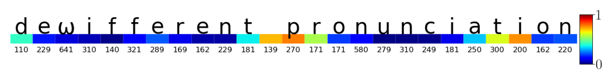

# [Identifying robust markers of Parkinson’s disease in typing behaviour using a CNN-LSTM network](https://www.aclweb.org/anthology/2020.conll-1.47.pdf)

There is an urgent need for non-intrusive tests that can detect early signs of Parkinson’s disease (PD), a debilitating neurodegenerative disorder that affects motor control. Recent promising research has focused on disease markers evident in the fine-motor behaviour of typing. Most work to date has focused solely on the timing of keypresses without reference to the linguistic content. In this paper we argue that the identity of the key combinations being produced should impact how they are handled by people with PD, and provide evidence that natural language processing methods can thus be of help in identifying signs of disease. We test the performance of a bi-directional LSTM with convolutional features in distinguishing people with PD from age-matched controls typing in English and Spanish, both in clinics and online.

Authors: Neil Dhir, Mathias Edman, Álvaro Sanchez Ferro, Tom Stafford and Colin Bannard

```
@inproceedings{dhir-etal-2020-identifying,
    title = "Identifying robust markers of {P}arkinson{'}s disease in typing behaviour using a {CNN}-{LSTM} network",
    author = "Dhir, Neil  and
      Edman, Mathias  and
      Sanchez Ferro, {\'A}lvaro  and
      Stafford, Tom  and
      Bannard, Colin",
    booktitle = "Proceedings of the 24th Conference on Computational Natural Language Learning",
    month = nov,
    year = "2020",
    address = "Online",
    publisher = "Association for Computational Linguistics",
    url = "https://www.aclweb.org/anthology/2020.conll-1.47",
    pages = "578--595"
}

```

## Highlight from the paper

The colours represent the importance of the different parts of the string for determining that the typist has Parkinson's disease. The bottom numbers are the inter-key intervals between typed characters.



## Installation & running the code

To promote reproducability we have provided a Dockerfile build on the tensorflow/tensorflow:2.1.0-gpu-py3 image.
For information on how to install docker please refer to <https://docs.docker.com/get-docker/>.

Once you have docker installed run the following command to build the docker image:

```
docker build -f Dockerfile . -t pdtyping
```

**OPTIONAL** To run a terminal in the container:

```
docker run --rm -it -v $(pwd):/opt/project pdtyping bash
```

Alternatively you can run scripts directly with the docker container via the run command.
Note that the following examples assumes that you have navigated to the repository root directory.

### Reproduce results

To download the *"Online English"* dataset into to the correct location run:

```
docker run --rm -it -v $(pwd):/opt/project pdtyping bash ./download_data.sh
```

After downloading the raw data, execute the data preprocessing script

```
docker run --rm -it -v $(pwd):/opt/project pdtyping python run_preprocessing.py
```

To reproduce the results from the "Online English" dataset presented in Table 2 execute the run_experiments.py
command line script with the corresponding flag.

`
-e timeandchar
` *Time and Character (one-hot)*

`
-e timeonly
` *Time Only*

`
-e word2vec
` *Time and Character (CBOW)*

E.g. to reproduce the "Time and Character (one-hot)" experiment for the "Online English" dataset run

```
docker run --rm -it -v $(pwd):/opt/project pdtyping python run_experiment.py -e timeandchar
```

The resulting predictions and logs will be written to `results/conll2020_MRC_{experiment flags}`.
To analyse and plot the results execute `evaluate.py` with flag `-d` pointing to the results directory. To split results for medicated and unmedicated subjects as in Table 2 use flag `-ms`


```
docker run --rm -it -v $(pwd):/opt/project pdtyping python evaluation.py -d results/conll2020_MRC_P-robust_G-robust_S-0_standard -ms
```


Finally if you wish to produce GradCam visualisations for the experiment
run `produce_gradcams.py` with flag `-d` pointing to the results directory.


```
docker run --rm -it -v $(pwd):/opt/project pdtyping python produce_gradcams.py -d results/conll2020_MRC_P-robust_G-robust_S-0_standard
```

## License

Copyright © Neil Dhir, Mathias Edman, Álvaro Sanchez Ferro, Tom Stafford and Colin Bannard

This is free software: you can redistribute it and/or modify
it under the terms of the GNU General Public License as published by
the Free Software Foundation, either version 3 of the License, or
(at your option) any later version.

It is distributed in the hope that it will be useful,
but WITHOUT ANY WARRANTY; without even the implied warranty of
MERCHANTABILITY or FITNESS FOR A PARTICULAR PURPOSE.  See the
GNU General Public License for more details.

You should have received a copy of the [GNU General Public License](gpl-3.0.txt) along with the software herein.  If not, see [http://www.gnu.org/licenses/](http://www.gnu.org/licenses/).
