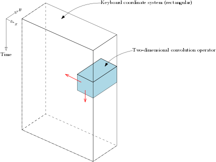
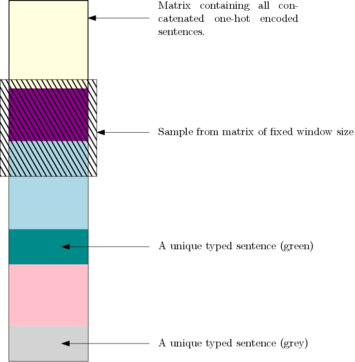

Natural language processing for habitual error detection
=========
Parkinson’s Disease can be understood as a disorder of motor habits. A prediction of this theory is that early stage Parkinson’s patients will display fewer errors caused by interference from previously over-learned behaviours. We test investigate this prediction in the domain of skilled typing, where actions are easy to record and errors easy to identify.

Models
-------

* Sentence classification via neural NLP.
* (Grammar error correction via neural NLP) this is not currently being pursued but it remains a good idea.

Goal
--------

Design an easy and simple test that would give early warning that habitual control is starting to degrade.

Data augmentation
-------
[New section as of 11/12/2019]

- Consider novel methods for data augmentation incl:
    - Keyboard matrix approach
    - Sample slice matrices from all concatenated typed sentences, per subject, converted to one-hot encoding

**Keyboard matrix**

**Slice sampling**

New modelling paradigms [new from 11/12/2019]
--------

- Do not use hyperparameter optimisation, not clear that it adds much
- Rebuild 1D convolutions from scratch, and progressively add complexity
- Add more early callbacks to prevent overfitting
- The model needs to be changed to take into account new data augmentation approaches
    - Keyboard matrix
    - Slice sampling all concatenated sentences per subject

Features
--------

* Raw typed sentences without being embedded
* Raw typed sentences as embedded vectors
* IKI
* Coordinates of all typed characters, per sentence, per subject
* On/off medication [this is not the target which is binary PD/HC]

Run the code!
--------
To promote reproducability we have provided a Dockerfile build on the tensorflow/tensorflow:2.1.0-gpu-py3 image.
For information on how to install docker please refer to https://docs.docker.com/get-docker/

Once you have docker installed run the following command to build the docker image:

..docker build -f Dockerfile . -t pdtyping::

